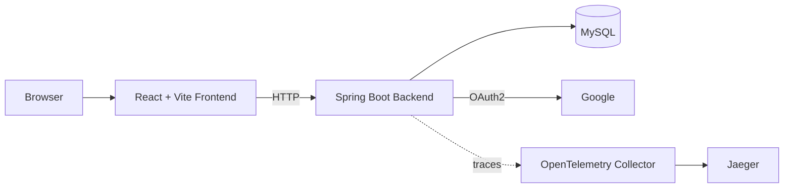

# Job Portal

[](https://github.com/jrodolfo/job-portal/actions/workflows/backend-docker-build.yml)
[](https://github.com/jrodolfo/job-portal/blob/main/job-portal-backend/pom.xml)
[](https://github.com/jrodolfo/job-portal/blob/main/job-portal-backend/pom.xml)
[](https://github.com/jrodolfo/job-portal/blob/main/job-portal-frontend/package.json)
[](https://github.com/jrodolfo/job-portal/blob/main/job-portal-frontend/package.json)
[](https://github.com/jrodolfo/job-portal/blob/main/docker-compose.yml)
[](https://github.com/jrodolfo/job-portal/blob/main/docker-compose.yml)
[](https://github.com/jrodolfo/job-portal/blob/main/job-portal-backend/src/main/resources/application.yml)
[](https://github.com/jrodolfo/job-portal/blob/main/job-portal-backend/src/main/resources/application.yml)
[](https://github.com/jrodolfo/job-portal/blob/main/docker-compose.yml)
[](./LICENSE)

Job Portal is a simplified full-stack web application that uses the job portal domain to demonstrate software engineering practices by evolving an existing codebase. The application implements a simplified subset of the functionality expected from a commercial job portal: applicants can register, browse jobs, apply, withdraw, and reapply; admins can manage jobs, review applications, update statuses, and enable or disable applicant accounts.

This project began with a [Pluralsight course](https://app.pluralsight.com/ilx/video-courses/full-stack-java-development-spring-boot-3-react) as a foundation. I extended it substantially to explore software architecture, testing, observability, cloud deployment, documentation, and refactoring.

Engineering work I added or expanded:

* **AWS Deployment:** Adapted the application for deployment on AWS, including environment configuration and cloud readiness considerations.
* **Docker Support:** Added Docker and Docker Compose support to simplify local development and keep runtime setup consistent.
* **OpenTelemetry Integration:** Integrated OpenTelemetry to provide distributed tracing and improve observability.
* **Bug Fixes and Stability Improvements:** Fixed issues from the original implementation, improving reliability and robustness.
* **Documentation Enhancements:** Expanded the project documentation, including setup, architecture, ADRs, database resources, API exploration, and helper scripts.
* **Structural Refactoring and Maintainability:** Refactored parts of the backend, frontend, tests, and scripts to make the codebase easier to understand and extend.

Backend namespace reference:
- Maven coordinates: `net.jrodolfo:jobportal`
- Java base package: `net.jrodolfo.jobportal`

## Architecture

The system is organized as a React/Vite frontend that calls a Spring Boot backend over HTTP. The backend exposes the REST API, implements authentication and authorization, applies the business rules, persists data in MySQL, and emits distributed traces through OpenTelemetry.



The Architecture Reference provides the complete system overview, runtime details, and sequence diagrams.

- Reference: [docs/architecture.md](./docs/architecture.md)
- Walkthrough: [docs/architecture-walkthrough.md](./docs/architecture-walkthrough.md)
- Architecture Decision Records: [docs/adr/README.md](./docs/adr/README.md)

**Rod Oliveira** | Software Developer | [jrodolfo.net](https://jrodolfo.net) | Halifax, Canada

---

## Quick Start

If you just want to start the full application locally and open it in a browser,
use the local helper script from the repository root:

```bash
bash scripts/local/start.sh
```

If you want a fuller local demo with preloaded jobs, users, and applications,
use:

```bash
bash scripts/local/start-with-demo-data.sh
```

This loads [docs/database/demo-seed.sql](./docs/database/demo-seed.sql) with
20 jobs, 4 users, and 30 applications across mixed statuses.

What this starts:

- frontend
- backend
- MySQL
- OpenTelemetry collector
- Jaeger

Default local URLs:

- Frontend: [http://localhost:5173](http://localhost:5173)
- Backend API: [http://localhost:8080](http://localhost:8080)
- Swagger UI: [http://localhost:8080/swagger-ui.html](http://localhost:8080/swagger-ui.html)
- OpenAPI JSON: [http://localhost:8080/v3/api-docs](http://localhost:8080/v3/api-docs)
- Jaeger UI: [http://localhost:16686](http://localhost:16686)
- MySQL: `localhost:3307`

How to stop everything:

```bash
bash scripts/local/stop.sh
```

Default local frontend login credentials:

- Applicant user: `user@local.test` / `user123`
- Admin user: `admin@local.test` / `admin123`
- New applicants can also create their own account from the login page.

What the demo seed includes:

- The demo seed resets the `jobs`, `users`, and `applications` tables for demo purposes.
- It seeds database-backed local login users for the default credentials above.
- It also includes a disabled applicant user so the admin Users tab can show both enabled and disabled states.

Current local role workflows:

- Applicants can create an account, browse open jobs, apply, withdraw, and reapply.
- Admins can create, edit, close, reopen, and delete jobs.
- Admins can review applications, update application statuses, and filter/sort the application list.
- Admins can list users and enable or disable applicant users.
- Applicant accounts are created through public registration; admin users are read-only from the admin UI and cannot be created, edited, deleted, or promoted through this feature.
- Jobs with existing applications still cannot be deleted; they should be closed instead.

Current test commands:

- Backend: `mvn -f job-portal-backend/pom.xml test`
- Frontend unit/component tests: `cd job-portal-frontend && npm test`
- Frontend browser tests: `cd job-portal-frontend && npm run test:e2e`

GitHub Actions runs the backend and frontend unit/component test commands before
building Docker images. Use Java 21 for backend validation; newer local JDKs may
not match the Maven/Lombok compiler path used by this project.

Release checkpoint:

- No formal Git tag or GitHub Release has been published yet.
- Until the first release tag exists, treat `main` as the active validated branch.
- A reasonable first tag would be `v0.1.0` after the current admin/applicant workflow is accepted as a stable demo checkpoint.

First-run expectations:

- a first build can take several minutes because Docker may need to pull base images and build both application images
- the backend now runs Flyway on startup to apply the baseline schema migration
- the stack is ready when `docker compose ps` shows the containers running and the frontend URL loads in the browser
- the frontend can load before the backend is healthy, so if login fails, check `http://localhost:8080` and the backend container status too

## Local Stack

### A. Running the Application with Docker Compose

Use the Quick Start commands above for the normal full-stack local workflow.
The commands below cover direct Docker Compose usage and advanced local
development cases.

#### 1. Configure Environment Variables
Ensure you have a `.env` file in the root directory (see **Section C** below) with the necessary credentials, especially for Google OAuth2 if you plan to use it.

#### 2. Start the entire stack with Docker Compose directly
If you prefer to run Docker Compose directly instead of using the helper script:

```bash
docker compose up -d --build
```

#### 3. Start specific services
If you only want to run part of the stack:

- **Only the Database**:
  ```bash
  docker compose up -d db
  ```
- **Database and Backend**:
  ```bash
  docker compose up --build db backend
  ```

#### 4. Rebuild individual services

- Frontend-only changes: `docker compose up -d --build frontend`
- Backend-only changes: `docker compose up -d --build backend`
- Frontend and backend changes together: `docker compose up -d --build frontend backend`

#### 5. Reload demo data into a running stack

```bash
bash scripts/local/seed-demo-data.sh
```

Equivalent direct Docker command:

```bash
docker exec -i mysql-db mysql -ujobuser -pjobpass jobportal < docs/database/demo-seed.sql
```

#### 6. Stop the application
To stop and remove the containers:

```bash
bash scripts/local/stop.sh
```

Equivalent direct Docker Compose command:

```bash
docker compose down
```

Use `docker compose down -v` only when you intentionally want to reset local
database state, such as after a failed local migration or when you want a clean
MySQL volume.

#### 7. OpenTelemetry (Local)
The Docker setup includes OpenTelemetry Java auto-instrumentation for the backend and an OpenTelemetry Collector.

- Collector OTLP endpoints:
  - gRPC: `http://localhost:4317`
  - HTTP: `http://localhost:4318`
- Collector health: `http://localhost:13133`
- Jaeger UI: [http://localhost:16686](http://localhost:16686)

OpenTelemetry is started automatically as part of the standard Quick Start workflow.

#### 8. OpenTelemetry (EC2 / Prod)
Use the prod override file, which:
- switches collector config to `docs/otel/collector-prod.yaml`
- keeps backend tracing enabled
- sets a lower default trace sampling (`OTEL_TRACES_SAMPLER_ARG=0.1`)
- disables local Jaeger by default

Required env var for prod collector export:
- `OTEL_UPSTREAM_OTLP_ENDPOINT` (New Relic US: `https://otlp.nr-data.net`, EU: `https://otlp.eu01.nr-data.net`)
- `OTEL_UPSTREAM_API_KEY` (your New Relic ingest/license key)

```bash
docker compose -f docker-compose.yml -f docker-compose.prod.yml up -d --build
```

#### 9. OpenTelemetry Smoke Test (Local)
After starting with `bash scripts/local/start.sh`, run:

```bash
curl -i http://localhost:8080/api/jobs
curl -i -u user@local.test:user123 -X POST http://localhost:8080/api/auth/login
curl -i -u admin@local.test:admin123 -H "Content-Type: application/json" \
  -d '{"title":"OTel Test","description":"trace smoke test","company":"Local"}' \
  http://localhost:8080/api/jobs
```

Then verify in Jaeger (`http://localhost:16686`):

1. Service `job-portal-backend` appears in the service list.
2. New traces exist for `GET /api/jobs`, `POST /api/auth/login`, and `POST /api/jobs`.
3. At least one trace includes child spans (for example Spring MVC/security/database work).
4. Trace attributes include `deployment.environment=local`.

#### 10. Build Multi-Platform Images (ARM64 & AMD64)
GitHub Actions validates the backend and frontend, builds both Docker images on
pushes to `main`, and pushes them to Docker Hub when Docker Hub secrets are
configured:

- `jrodolfo/job-portal-backend`
- `jrodolfo/job-portal-frontend`

The local commands below remain useful when you want to publish both images
manually with `buildx`, especially for explicit multi-architecture pushes.

If you are developing on a Mac (ARM64) but deploy on EC2 (Linux/AMD64), push multi-architecture images:

```bash
scripts/local/upload-docker-images.sh
```

Or run directly from repo root:

```bash
docker buildx bake -f docker-bake.hcl --push
```

Verify both architectures are present before deploying to EC2:

```bash
docker buildx imagetools inspect jrodolfo/job-portal-backend:latest
docker buildx imagetools inspect jrodolfo/job-portal-frontend:latest
```

Each image must include both `linux/amd64` and `linux/arm64`.

---

### B. Database for Local Development (Alternative)

If you prefer to run the backend or frontend locally (not in Docker) while still using a containerized database:

1) Quick builds/tests (no Docker/MySQL required)
- The Maven build is configured so unit tests do NOT require a running database. You can run:
  - `mvn -f job-portal-backend/pom.xml clean verify`
- The application itself (when you actually run it) still expects MySQL as configured in `application.yml`.

2) Run only MySQL using Docker Compose
- Start the MySQL database:
  ```bash
  docker compose up -d db
  ```
- Once the database is running, you can run the applications:
  - **Backend (IDE)**: Run `JobportalApplication` main class.
  - **Backend (Maven)**: `mvn spring-boot:run` inside `job-portal-backend`.
  - **Frontend (npm)**: `npm install` and `npm run dev` inside `job-portal-frontend`.

### B.1 Local Frontend and Backend URLs

If you run the applications outside Docker:

- Frontend dev server: `http://localhost:5173`
- Backend API: `http://localhost:8080`
- Swagger UI: `http://localhost:8080/swagger-ui.html`

The frontend talks to the backend on port `8080`, so the backend must be running before login and job flows will work.

---

### C. Environment Configuration:

The project is configured with safe defaults for local development. However, you can override them by creating a file named `.env` in the root directory:

```env
# Common MySQL credentials
MYSQL_ROOT_PASSWORD=root
MYSQL_DATABASE=jobportal
MYSQL_USER=jobuser
MYSQL_PASSWORD=jobpass

# Google OAuth2 Credentials (Optional, required for Google Login)
GOOGLE_CLIENT_ID=your-google-client-id
GOOGLE_CLIENT_SECRET=your-google-client-secret

# JWT Secret Key (Optional, uses default if not provided)
JWT_SECRET_KEY=MY_SECRET_KEY_123456789012345678901234567890

# Allowed Origins for CORS (Optional, defaults to http://localhost:5173)
ALLOWED_ORIGINS=http://localhost:5173,http://your-ec2-ip:5173

# OpenTelemetry defaults (local)
OTEL_SERVICE_NAME=job-portal-backend
OTEL_RESOURCE_ATTRIBUTES=service.namespace=job-portal,service.version=0.0.1-SNAPSHOT,deployment.environment=local
OTEL_TRACES_SAMPLER=parentbased_traceidratio
OTEL_TRACES_SAMPLER_ARG=1.0
OTEL_EXPORTER_OTLP_PROTOCOL=grpc
OTEL_EXPORTER_OTLP_ENDPOINT=http://otel-collector:4317
OTEL_PROPAGATORS=tracecontext,baggage
OTEL_TRACES_EXPORTER=otlp
OTEL_METRICS_EXPORTER=none
OTEL_LOGS_EXPORTER=none

# OpenTelemetry upstream endpoint for EC2/prod collector (required in prod override)
# Example:
# OTEL_UPSTREAM_OTLP_ENDPOINT=https://otlp.nr-data.net
# OTEL_UPSTREAM_API_KEY=your-new-relic-ingest-key
#OTEL_UPSTREAM_OTLP_ENDPOINT=
#OTEL_UPSTREAM_API_KEY=
```

---

### D. How to run this code on an AWS EC2 Amazon Linux instance

Use an EC2 instance such as `t3.small` and prepare it with the helper scripts from:

- https://github.com/jrodolfo/aws-ec2

SSH setup notes:

- https://github.com/jrodolfo/aws-ec2/blob/main/doc/ssh/NOTES.md

After SSH into your instance:

```bash
git clone https://github.com/jrodolfo/job-portal.git
cd job-portal
```

Create a `.env` file in the repo root and copy the template from **Section C. Environment Configuration**.

Required values for EC2 deployment:

- Google OAuth credentials (`GOOGLE_CLIENT_ID`, `GOOGLE_CLIENT_SECRET`)
- Your EC2 public IP (get it on EC2 with `curl https://checkip.amazonaws.com`)
- `OTEL_UPSTREAM_OTLP_ENDPOINT` and `OTEL_UPSTREAM_API_KEY` (OpenTelemetry upstream export)
- `AWS_EC2_IP4` and `AWS_EC2_NAME`

Start containers:

```bash
./scripts/prod/start.sh
```

Verify containers:

```bash
docker ps
```

Expected services:

- `job-portal-frontend`
- `job-portal-backend`
- `mysql-db`
- `otel-collector`

Security Group inbound rules (recommended locked to your local machine IP):

- Type: `Custom TCP`, Protocol: `TCP`, Port: `8080`, Source: `1.2.3.4/32`
- Type: `Custom TCP`, Protocol: `TCP`, Port: `5173`, Source: `1.2.3.4/32`

Find your local public IP:

```bash
curl https://checkip.amazonaws.com
```

If EC2 public IP is `5.6.7.8`, access:

- Frontend: `http://5.6.7.8:5173/`
- Backend: `http://5.6.7.8:8080/`

Google OAuth note:

- Update your Google Cloud OAuth Web Application settings to include your EC2 public IP URLs (origins/redirects) used by this app.

---

### E. Steps to smoke test the Google Cloud OAuth feature:

1. **Go to Google Cloud** and get the secrets for your Web Application (not Desktop, not Mobile application):
   - **Client ID**: `xxxx`
   - **Client Secret**: `yyyy`

   Enter these two values in the `.env` file at the root of the project:
   ```env
   GOOGLE_CLIENT_ID=xxxx
   GOOGLE_CLIENT_SECRET=yyyy
   ```

   The `application.yml` file is configured to use these environment variables.

2. **Go to**: [http://localhost:8080/oauth2/authorization/google](http://localhost:8080/oauth2/authorization/google) and enter your Google credentials.

3. **Go to**: [http://localhost:8080/api/oauth/user](http://localhost:8080/api/oauth/user) and get a Google OpenID Connect ID token payload like this:
   ```json
   {
     "at_hash": "aaa",
     "sub": "bbb",
     "email_verified": true,
     "iss": "https://accounts.google.com",
     "given_name": "ccc",
     "nonce": "ddd",
     "picture": "https://lh3.googleusercontent.com/a/eee",
     "aud": [
       "fff.apps.googleusercontent.com"
     ],
     "azp": "ggg.apps.googleusercontent.com",
     "name": "hhh",
     "exp": "2026-02-01T17:58:45Z",
     "family_name": "iii",
     "iat": "2026-02-01T16:58:45Z",
     "email": "jjjj@test.com"
   }
   ```

4. **Go to**: [http://localhost:8080/api/oauth/token](http://localhost:8080/api/oauth/token) and get a JWT token like this:
   `eyJhbGc29udGVudC5jb20iLCJz...dWIiOiIxMTM0NTc2NjA1NjY`

   You can paste this token on [jwt.io](https://www.jwt.io/) to decode it. You will get something like this:
   ```json
   {
     "alg": "RS256",
     "kid": "c27...122",
     "typ": "JWT"
   }
   {
     "iss": "https://accounts.google.com",
     "azp": "1...a.apps.googleusercontent.com",
     "aud": "1.....apps.googleusercontent.com",
     "sub": "11111",
     "email": "xxx@test.com",
     "email_verified": true,
     "at_hash": "zzzz",
     "nonce": "....",
     "name": "ABC",
     "picture": "https://googleusercontent.com/....",
     "given_name": "X",
     "family_name": "Y",
     "iat": 1770227337,
     "exp": 1770230937
   }
   {
     "e": "AQAB",
     "kty": "RSA",
     "n": "ubOB3C56t2P...mrXJrc2Ws2sizhSqjrPzL"
   }
   ```

5. **Test other endpoints**:
   - [http://localhost:8080/api/oauth/exchange-token](http://localhost:8080/api/oauth/exchange-token)
   - [http://localhost:8080/api/oauth/user-details](http://localhost:8080/api/oauth/user-details)

---

### F. Steps for smoke test the backend API:

1. **Load the Insomnia collection** (inside the folder `docs/insomnia`).
2. **Execute the applicant registration request** to add a new applicant user:
   Use the public registration endpoint. Admins can list users and enable or disable applicant access, but they do not create applicant accounts from the admin API.
   ```json
   {
     "name": "demo-applicant",
     "email": "demo.applicant@example.com",
     "password": "applicant123"
   }
   ```
3. **Execute the "add job" POST request** to add a new job:
   Use Basic Auth with `admin@local.test` / `admin123` (ROLE_ADMIN). The default `user@local.test` / `user123` (ROLE_APPLICANT) will receive 403 Forbidden for this endpoint by design.
   ```json
   {
     "title": "Java Developer",
     "description": "Develop java applications",
     "company": "XYZ"
   }
   ```
---

### G. Integration Test

1. **Start the front end**:
   Go to the folder `job-portal-frontend` and type:
   ```bash
   npm install
   npm run dev
   ```
2. **Go to the URL of the Web Application**: [http://localhost:5173](http://localhost:5173)
3. **Login with credentials**: `user@local.test`, `user123` and run tests.
4. **Try to apply for a job**. Check the database running the queries on `docs/database/queries.sql`.

---

### H. Helper Scripts

Scripts are organized by environment:

#### 1. Local scripts (`scripts/local`)

Recommended usage from the repository root:

- Start: `bash scripts/local/start.sh`
- Start with demo data: `bash scripts/local/start-with-demo-data.sh`
- Stop: `bash scripts/local/stop.sh`

If you first change directory into `scripts/local`, then use:

- Start: `./start.sh`
- Start with demo data: `./start-with-demo-data.sh`
- Stop: `./stop.sh`

- macOS/Linux:
  - Start: `bash scripts/local/start.sh`
  - Start with demo data: `bash scripts/local/start-with-demo-data.sh`
  - Stop: `bash scripts/local/stop.sh`
- Windows CMD:
  - Start: `scripts\local\start.bat`
  - Stop: `scripts\local\stop.bat`
- Windows PowerShell:
  - Start: `./scripts/local/start.ps1`
  - Stop: `./scripts/local/stop.ps1`

#### 2. Prod scripts (`scripts/prod`) for EC2 Linux

- Start: `bash scripts/prod/start.sh`
- Stop: `bash scripts/prod/stop.sh`
- Compose compatibility: scripts auto-detect `docker compose` (v2) and fall back to `docker-compose` (v1).

`scripts/prod/start.sh` uses both compose files and requires:
- `OTEL_UPSTREAM_OTLP_ENDPOINT` to be set
- `OTEL_UPSTREAM_API_KEY` to be set

#### 3. Script permissions policy

- `*.sh` files should be executable.
- `*.bat` and `*.ps1` files should remain non-executable on Unix systems.
- Validate at any time with:

```bash
./scripts/check-script-modes.sh
```

### I. API Documentation (Swagger/OpenAPI)

After the backend is running:

- Swagger UI: `http://localhost:8080/swagger-ui.html`
- OpenAPI JSON: `http://localhost:8080/v3/api-docs`

Authentication in Swagger UI:

1. Use **Authorize** and provide Basic credentials for endpoints protected with `basicAuth`.
2. For bearer-protected endpoints, first call `/api/auth/login`, copy the returned token, and authorize with:
   - `<token>`

## Troubleshooting

### The script finished, but I do not know what to open

Use these local URLs:

- Frontend: `http://localhost:5173`
- Backend: `http://localhost:8080`
- Swagger UI: `http://localhost:8080/swagger-ui.html`
- Jaeger: `http://localhost:16686`

### Startup took a long time

That is normal on a first run. Docker may need to pull images, build the frontend and backend images, and initialize the MySQL schema through Flyway.

### I want to know whether the containers are healthy

Run:

```bash
docker compose ps
```

You can also inspect backend logs with:

```bash
docker compose logs -f backend
```

### The frontend does not load

Check whether the frontend container is running:

```bash
docker compose ps frontend
```

Then open `http://localhost:5173` again.

### The backend does not respond yet

Inspect backend logs:

```bash
docker compose logs -f backend
```

The backend may still be waiting for MySQL or applying Flyway migrations.

### The backend keeps restarting after a failed local Flyway migration

This usually means MySQL still has a failed migration record in the local Docker volume. For a local development reset, remove the containers and the MySQL volume, then start again:

```bash
docker compose down -v
bash scripts/local/start.sh
```

This is the fastest recovery path when you do not need to preserve local database contents.

### The login page says `Invalid credentials`, but the backend URL is down

In that case the message is misleading. The frontend login form can still load while the backend container is unavailable. Check:

```bash
docker compose ps
docker compose logs -f backend
```

If `job-portal-backend` is restarting, fix the backend startup problem first, then try logging in again with `user@local.test` / `user123`.

## Contact

- Software Developer: Rod Oliveira
- GitHub: https://github.com/jrodolfo
- Webpage: https://jrodolfo.net

## License

- MIT License
- Copyright (c) 2026 Rod Oliveira
- See [LICENSE](./LICENSE)
