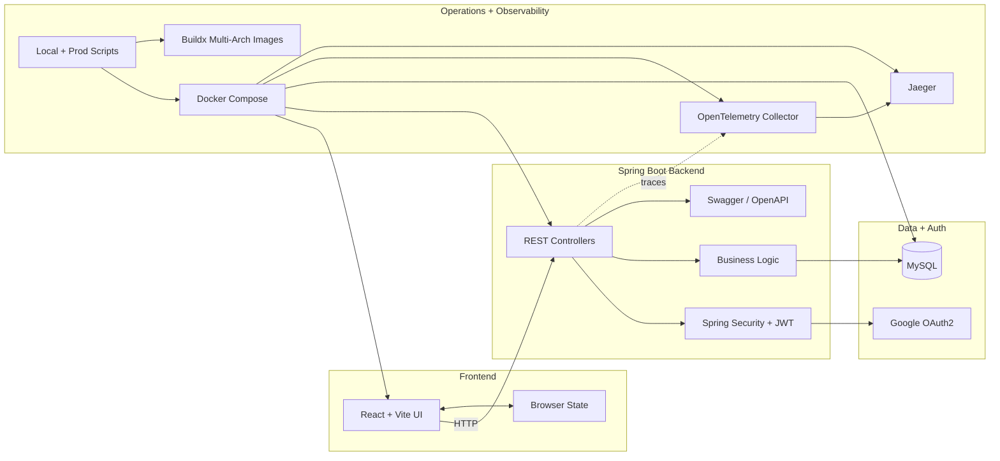
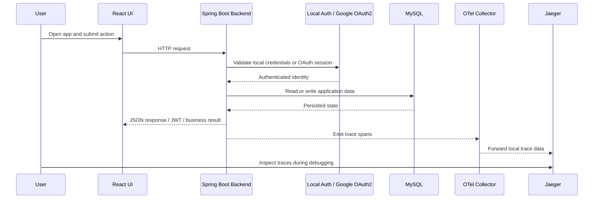
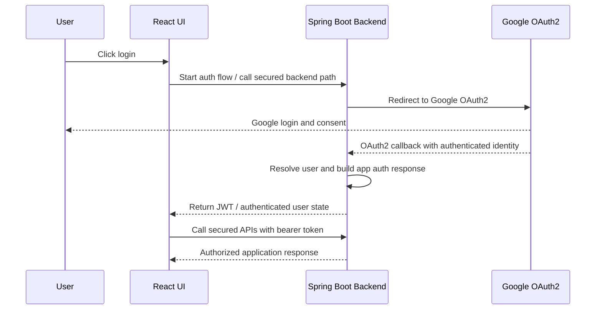

# Architecture

This document is the maintained architectural reference for `Job Portal`.

Use it when you need a more structured view than the root
[`README.md`](../README.md), but a more system-focused document than the
conversational [`architecture-walkthrough.md`](./architecture-walkthrough.md).

The Mermaid diagram below is the compact source of truth for the current system
shape. It is easier to review in Git diffs and easier to update when runtime
boundaries change.

## Architecture Overview

The diagram captures the main architectural boundaries:

- `Frontend` covers React routing, browser interaction, and client-side state.
- `Spring Boot Backend` covers REST APIs, security, business logic, JWT
  issuance, and OpenAPI exposure.
- `Data + Auth` covers MySQL persistence and Google OAuth2 as an external
  identity dependency.
- `Operations + Observability` covers Docker Compose, collector config, Jaeger,
  and environment-driven deployment/runtime behavior.

## Key Runtime Flow

This second diagram focuses on how a typical local full-stack interaction moves
through the system, including authentication and tracing.

## Authentication Flow

This diagram focuses on the Google OAuth2 and JWT-oriented authentication path.

## Runtime Components

### Frontend

The frontend lives in `job-portal-frontend` and uses React with Vite.

Its main responsibilities are:

- browser routing and page composition
- login and OAuth-related UI flows
- user interaction for applicants and admins
- client-side state through Redux Toolkit
- backend API consumption through HTTP

Relevant files:

- `job-portal-frontend/package.json`
- `job-portal-frontend/src/main.jsx`
- `job-portal-frontend/src/App.jsx`
- `job-portal-frontend/src/store/store.js`
- `job-portal-frontend/src/config/backend.js`

### Backend

The backend lives in `job-portal-backend` and uses Spring Boot 3 with Java 21.

Its main responsibilities are:

- REST API exposure
- authentication and authorization
- JWT issuance and secured API handling
- Google OAuth2 integration
- persistence via Spring Data JPA
- OpenAPI/Swagger exposure

Relevant files:

- `job-portal-backend/pom.xml`
- `job-portal-backend/src/main/resources/application.yml`

### Persistence

The system uses MySQL as the primary runtime database.

Local default configuration points to MySQL on port `3307`, and the Docker
stack supplies the database container used by the backend.

The backend currently uses Hibernate schema updates through
`spring.jpa.hibernate.ddl-auto=update`, which is documented as an explicit
architectural choice in ADR 0009.

### Authentication Model

The project uses a hybrid authentication model:

- local username/password support for application and development flows
- Google OAuth2 / OpenID Connect support through Spring Security
- JWT-based backend access after authentication where appropriate

This keeps the project useful both as a runnable application and as an example
of more realistic auth integration.

## Local Runtime Topology

The default integrated local runtime is Docker Compose.

The main stack includes:

- frontend container
- backend container
- MySQL container
- OpenTelemetry collector
- Jaeger

Relevant files:

- `docker-compose.yml`
- `docker-compose.prod.yml`
- `scripts/local/start.sh`
- `scripts/local/stop.sh`

This arrangement is important because it makes the repo runnable as a complete
system instead of a loose set of code folders.

## Deployment Shape

The repository is designed to support EC2-oriented deployment workflows even
though it remains easy to run locally.

Two deployment-related ideas are especially important:

- prod startup uses `docker-compose.yml` plus `docker-compose.prod.yml`
- images are built and published for both `linux/amd64` and `linux/arm64`

Relevant files:

- `scripts/prod/start.sh`
- `scripts/prod/stop.sh`
- `docker-bake.hcl`
- `scripts/local/upload-docker-images.sh`

## Observability Model

Observability is built around OpenTelemetry with a collector-centered design.

The backend emits traces, the collector receives and routes them, and local
runs expose Jaeger for visualization. Prod-oriented runs keep the collector in
the middle and forward upstream through environment-driven configuration.

Relevant files:

- `docs/otel/collector-local.yaml`
- `docs/otel/collector-prod.yaml`
- `docker-compose.yml`
- `docker-compose.prod.yml`
- `job-portal-backend/Dockerfile`

## Security Boundary

The backend is the main security boundary of the system.

The frontend does not directly own auth policy. Instead:

- the browser talks to the backend
- the backend enforces security configuration
- OAuth integration and JWT issuance stay server-side

This is one of the most important architectural choices in the repo because it
keeps security behavior centralized and easier to reason about.

## Documentation and Operational Assets

The `docs/` directory is part of the architecture story, not just an appendix.

It contains:

- API exploration assets under `docs/insomnia`
- query helpers under `docs/database`
- observability config under `docs/otel`
- operational notes and Docker-related support files

These assets matter because they explain how the system is actually run,
debugged, and demonstrated.

## Related Documents

- Project overview: [`../README.md`](../README.md)
- Architecture walkthrough: [`architecture-walkthrough.md`](./architecture-walkthrough.md)
- ADR index: [`adr/README.md`](./adr/README.md)
