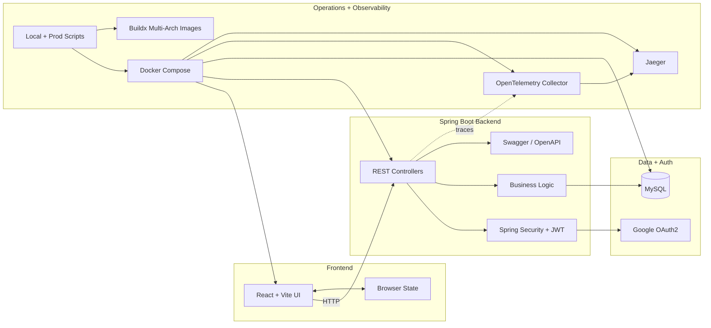
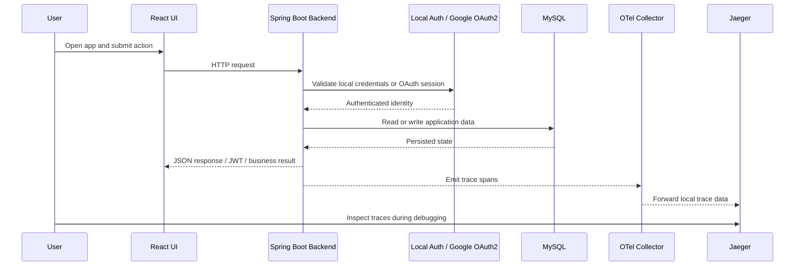
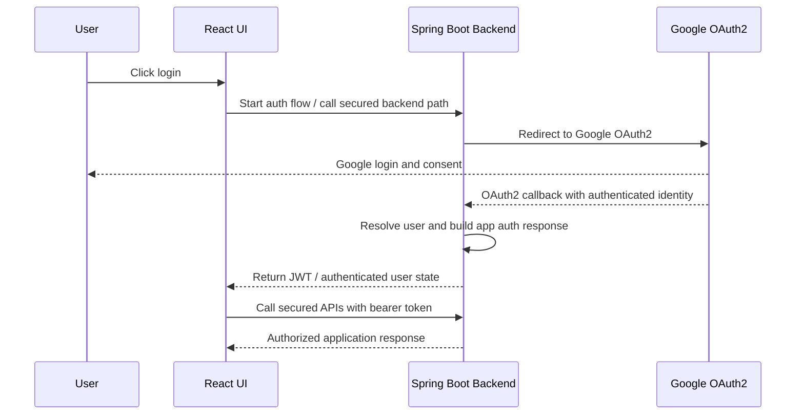

# Architecture

This document is the maintained architectural reference for `Job Portal`.

Use it when you need a more structured view than the root
[`README.md`](../README.md), but a more system-focused document than the
conversational [`architecture-walkthrough.md`](./architecture-walkthrough.md).

The Mermaid diagram below provides a compact view of the current system shape.
It is easier to review in Git diffs and easier to update when runtime boundaries
change.

## Architecture Overview

The diagram captures the main architectural boundaries:

- `Frontend` covers React routing, browser interaction, and client-side state.
- `Spring Boot Backend` covers REST APIs, security, business logic, JWT
  issuance, and OpenAPI exposure.
- `Data + Auth` covers MySQL persistence and Google OAuth2 as an external
  identity dependency.
- `Operations + Observability` covers Docker Compose, collector config, Jaeger,
  and environment-driven deployment/runtime behavior.

## Key Runtime Flow

This second diagram focuses on how a typical local full-stack interaction moves
through the system, including authentication and tracing.

## Authentication Flow

This diagram focuses on the Google OAuth2 and JWT-oriented authentication path.

## Runtime Components

### Frontend

The frontend lives in `job-portal-frontend` and uses React with Vite.

Its main responsibilities are:

- browser routing and page composition
- login and OAuth-related UI flows
- user interaction for applicants and admins
- applicant-side application lifecycle behavior such as apply, withdraw, and
  reapply
- admin-side job and application review workflows
- admin-side applicant user management workflows
- client-side state through Redux Toolkit
- backend API consumption through HTTP

In the current UI, those responsibilities surface as:

- applicant job cards that show open jobs, application status, and application
  timestamps when available
- an admin dashboard with overview cards plus `Jobs`, `Add Job`,
  `Applications`, and `Users` tabs
- grouped admin application review views with search, status filtering, and
  status-update actions
- admin user management limited to applicant accounts, with admin records shown
  as read-only

Relevant files:

- `job-portal-frontend/package.json`
- `job-portal-frontend/src/main.jsx`
- `job-portal-frontend/src/App.jsx`
- `job-portal-frontend/src/store/store.js`
- `job-portal-frontend/src/config/backend.js`

Representative UI and state files:

- `job-portal-frontend/src/components/Login.jsx`
- `job-portal-frontend/src/components/OAuthLogin.jsx`
- `job-portal-frontend/src/components/AdminDashboard.jsx`
- `job-portal-frontend/src/components/AdminApplicationsPanel.jsx`
- `job-portal-frontend/src/components/ApplicantDashboard.jsx`
- `job-portal-frontend/src/store/userActions.js`
- `job-portal-frontend/src/store/userReducer.js`

### Backend

The backend lives in `job-portal-backend` and uses Spring Boot 3 with Java 21.

Its main responsibilities are:

- REST API exposure
- authentication and authorization
- JWT issuance and secured API handling
- Google OAuth2 integration
- persistence via Spring Data JPA
- OpenAPI/Swagger exposure

Relevant files:

- `job-portal-backend/pom.xml`
- `job-portal-backend/src/main/resources/application.yml`

Representative backend implementation files:

- `job-portal-backend/src/main/java/net/jrodolfo/jobportal/JobportalApplication.java`
- `job-portal-backend/src/main/java/net/jrodolfo/jobportal/controller/JobController.java`
- `job-portal-backend/src/main/java/net/jrodolfo/jobportal/controller/ApplicationController.java`
- `job-portal-backend/src/main/java/net/jrodolfo/jobportal/controller/LoginController.java`
- `job-portal-backend/src/main/java/net/jrodolfo/jobportal/controller/OAuthController.java`
- `job-portal-backend/src/main/java/net/jrodolfo/jobportal/service/JobService.java`
- `job-portal-backend/src/main/java/net/jrodolfo/jobportal/service/ApplicationService.java`
- `job-portal-backend/src/main/java/net/jrodolfo/jobportal/service/UserService.java`

The backend is intentionally treated as a reusable REST/OpenAPI surface rather
than a private transport layer only for the bundled frontend. That is reflected
in the Swagger exposure, the Insomnia assets under `docs/insomnia`, and the
curl-oriented examples in the root README.

### Persistence

The system uses MySQL as the primary runtime database.

Local default configuration points to MySQL on port `3307`, and the Docker
stack supplies the database container used by the backend.

The backend uses Flyway to apply versioned schema changes and Hibernate
validation to ensure the runtime entity model still matches the expected
database shape. The initial migration is a compatibility-oriented baseline so
existing local databases can transition away from runtime schema mutation
without forcing a destructive reset.

This schema-management approach is documented in ADR 0012 and supersedes the
earlier `ddl-auto=update` decision recorded in ADR 0009.

The current persistence behavior also encodes lifecycle rules that matter to
the application model:

- jobs now carry an explicit `OPEN` / `CLOSED` lifecycle state
- public job discovery is limited to `OPEN` jobs
- application records remain meaningful after `WITHDRAWN` instead of being
  deleted
- previously withdrawn applications can be reactivated when an applicant
  reapplies
- jobs with existing applications cannot be hard-deleted and return
  `409 Conflict` instead

Representative persistence files:

- `job-portal-backend/src/main/java/net/jrodolfo/jobportal/model/User.java`
- `job-portal-backend/src/main/java/net/jrodolfo/jobportal/model/Job.java`
- `job-portal-backend/src/main/java/net/jrodolfo/jobportal/model/Application.java`
- `job-portal-backend/src/main/java/net/jrodolfo/jobportal/repository/UserRepository.java`
- `job-portal-backend/src/main/java/net/jrodolfo/jobportal/repository/JobRepository.java`
- `job-portal-backend/src/main/java/net/jrodolfo/jobportal/repository/ApplicationRepository.java`
- `job-portal-backend/src/main/java/db/migration/V1__baseline_job_portal_schema.java`
- `job-portal-backend/src/main/resources/db/migration/V2__expand_job_description_length.sql`
- `job-portal-backend/src/main/resources/db/migration/V3__add_job_status.sql`
- `job-portal-backend/src/main/resources/db/migration/V4__add_user_enabled.sql`
- `docs/database/queries.sql`

### Authentication Model

The project uses a hybrid authentication model:

- database-backed local email/password support for application and
  development flows, including applicant self-registration
- Google OAuth2 / OpenID Connect support through Spring Security
- JWT-based backend access after authentication where appropriate

This keeps the project useful both as a runnable application and as an example
of more realistic auth integration.

Local default accounts are bootstrapped when missing. Applicant accounts are
created through public registration. Admin user management is intentionally
limited to access control: admins can list users and enable or disable applicant
access. Admin accounts are not created, deleted, promoted, or edited through this
dashboard flow.

Representative authentication files:

- `job-portal-backend/src/main/java/net/jrodolfo/jobportal/config/SecurityConfig.java`
- `job-portal-backend/src/main/java/net/jrodolfo/jobportal/config/JwtAuthFilter.java`
- `job-portal-backend/src/main/java/net/jrodolfo/jobportal/util/JwtUtil.java`
- `job-portal-backend/src/main/java/net/jrodolfo/jobportal/controller/LoginController.java`
- `job-portal-backend/src/main/java/net/jrodolfo/jobportal/controller/OAuthController.java`
- `job-portal-frontend/src/components/Login.jsx`
- `job-portal-frontend/src/components/OAuthLogin.jsx`

## Local Runtime Topology

The default integrated local runtime is Docker Compose.

The main stack includes:

- frontend container
- backend container
- MySQL container
- OpenTelemetry collector
- Jaeger

Relevant files:

- `docker-compose.yml`
- `docker-compose.prod.yml`
- `scripts/local/start.sh`
- `scripts/local/stop.sh`

Supporting files:

- `job-portal-frontend/Dockerfile`
- `job-portal-backend/Dockerfile`
- `docs/insomnia/README.md`

This arrangement is important because it makes the repo runnable as an
integrated system instead of a loose set of code folders.

## Application Lifecycle

The current system has an explicit applicant/admin workflow rather than only a
generic CRUD model.

Applicants can:

- browse the current open job list
- submit an application
- withdraw an application
- reapply after withdrawal
- view the current application status directly on each job card

Admins can:

- create, edit, close, reopen, and delete jobs when no applications exist
- see application counts per job
- review applications in grouped admin views
- update application states such as `REVIEWING`, `ACCEPTED`, and `REJECTED`
- list users
- enable or disable applicant users

The visibility rule is intentionally asymmetric:

- applicants only see `OPEN` jobs
- admins can see both `OPEN` and `CLOSED` jobs through the authenticated admin view
- admin users are visible but read-only in the user-management UI

This lifecycle is not just UI behavior. It is enforced jointly by backend
services and frontend dashboards, and the durable rules are captured in
[ADR 0013](./adr/0013-define-job-and-application-lifecycle-rules.md).
The admin user-management boundary is captured in
[ADR 0014](./adr/0014-limit-admin-user-management-to-applicants.md).

Relevant files:

- `job-portal-backend/src/main/java/net/jrodolfo/jobportal/service/ApplicationService.java`
- `job-portal-backend/src/main/java/net/jrodolfo/jobportal/service/JobService.java`
- `job-portal-frontend/src/components/ApplicantDashboard.jsx`
- `job-portal-frontend/src/components/AdminDashboard.jsx`
- `job-portal-frontend/src/components/AdminApplicationsPanel.jsx`

## Deployment Shape

The repository is designed to support host-based deployment workflows on Linux
machines, including EC2-style environments, even though it remains easy to run
locally.

Two deployment-related ideas are especially important:

- host-based startup uses `docker-compose.yml` plus `docker-compose.prod.yml`
- images are built and published for both `linux/amd64` and `linux/arm64`
- GitHub Actions validates backend/frontend tests, builds both Docker images, and pushes them when Docker Hub secrets are configured

Relevant files:

- `.github/workflows/backend-docker-build.yml`
- `scripts/prod/start.sh`
- `scripts/prod/stop.sh`
- `docker-bake.hcl`
- `scripts/local/upload-docker-images.sh`

Supporting files:

- `docker-compose.prod.yml`
- `docs/otel/collector-prod.yaml`

## Observability Model

Observability is built around OpenTelemetry with a collector-centered design.

The backend emits traces, the collector receives and routes them, and local
runs expose Jaeger for visualization. Deployed-host runs keep the collector in
the middle and forward upstream through environment-driven configuration.

Relevant files:

- `docs/otel/collector-local.yaml`
- `docs/otel/collector-prod.yaml`
- `docker-compose.yml`
- `docker-compose.prod.yml`
- `job-portal-backend/Dockerfile`

Supporting backend files:

- `job-portal-backend/src/main/resources/application.yml`
- `job-portal-backend/README.md`

## Security Boundary

The backend is the main security boundary of the system.

The frontend does not directly own auth policy. Instead:

- the browser talks to the backend
- the backend enforces security configuration
- OAuth integration and JWT issuance stay server-side

This is one of the most important architectural choices in the repo because it
keeps security behavior centralized and easier to reason about.

## Verification Model

The repository now relies on four complementary verification layers:

- backend tests with Maven for controller, service, security, and schema-aware
  behavior
- frontend unit and component tests with Vitest for dashboard, auth, and UI
  state behavior
- MSW-backed frontend integration tests for realistic request/response flows
  without the real backend
- browser workflow tests with Playwright for end-to-end flows such as admin
  job management, applicant apply/withdraw/reapply, and admin review

This matters architecturally because the project now encodes meaningful
cross-role workflow rules. Unit-level coverage alone would not be enough to
protect route guarding, browser auth state, and dashboard interaction paths.

Relevant files:

- `job-portal-backend/src/test/java/net/jrodolfo/jobportal/controller/`
- `job-portal-backend/src/test/java/net/jrodolfo/jobportal/service/`
- `job-portal-frontend/src/components/*.test.jsx`
- `job-portal-frontend/src/components/*.integration.test.jsx`
- `job-portal-frontend/tests/e2e/admin-crud.spec.js`
- `job-portal-frontend/tests/e2e/applicant-status.spec.js`
- `job-portal-frontend/tests/e2e/helpers.js`

Code areas that reinforce this boundary:

- `job-portal-backend/src/main/java/net/jrodolfo/jobportal/config/SecurityConfig.java`
- `job-portal-backend/src/main/java/net/jrodolfo/jobportal/config/JwtAuthFilter.java`
- `job-portal-backend/src/main/java/net/jrodolfo/jobportal/controller/LoginController.java`
- `job-portal-backend/src/main/java/net/jrodolfo/jobportal/controller/OAuthController.java`
- `job-portal-frontend/src/config/backend.js`

## Documentation and Operational Assets

The `docs/` directory is part of the architecture story, not just an appendix.

It contains:

- API exploration assets under `docs/insomnia`
- query helpers under `docs/database`
- observability config under `docs/otel`
- operational notes and Docker-related support files

These assets matter because they explain how the system is actually run,
debugged, and demonstrated.

## Related Documents

- Project overview: [`../README.md`](../README.md)
- Architecture walkthrough: [`architecture-walkthrough.md`](./architecture-walkthrough.md)
- ADR index: [`adr/README.md`](./adr/README.md)
